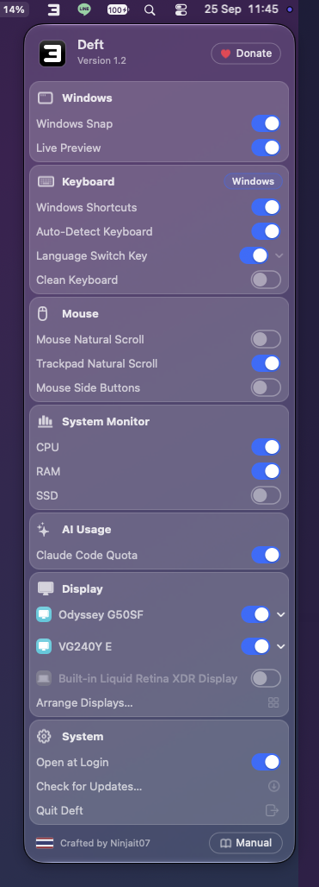
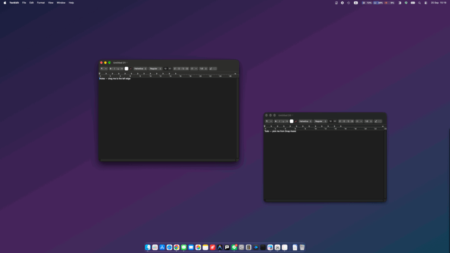
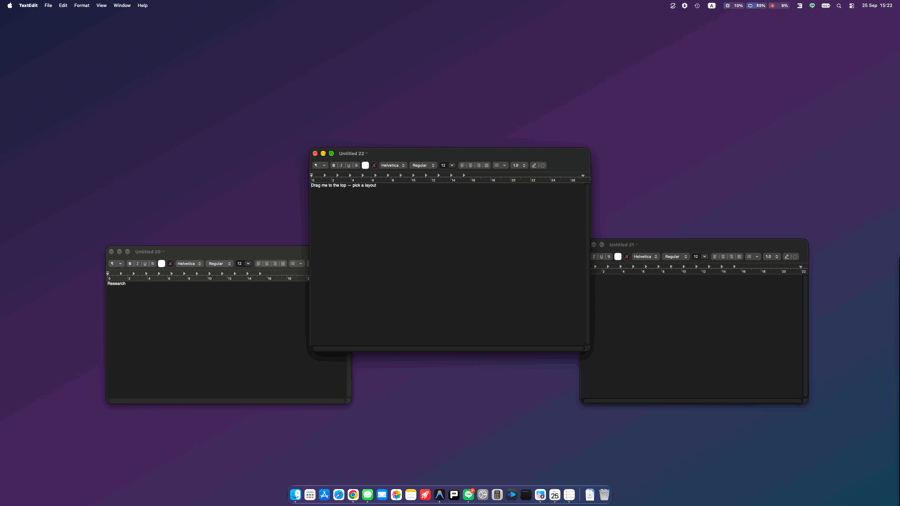
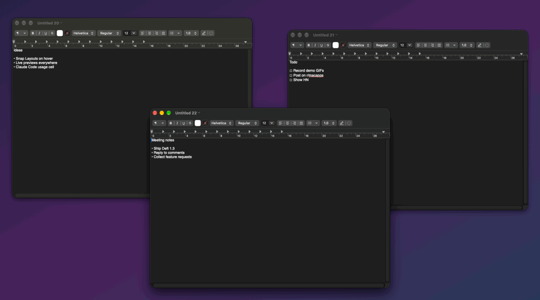
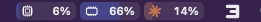
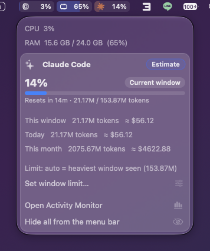
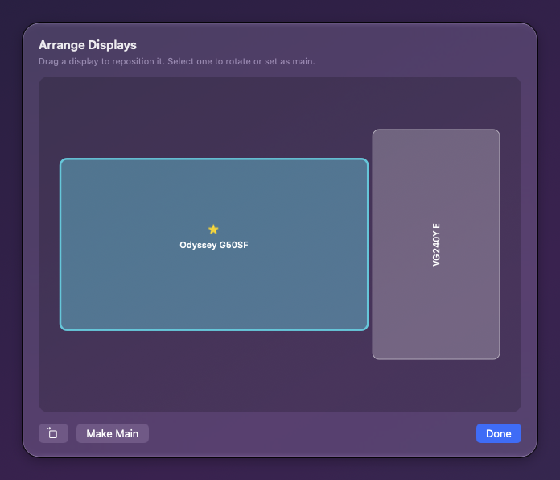
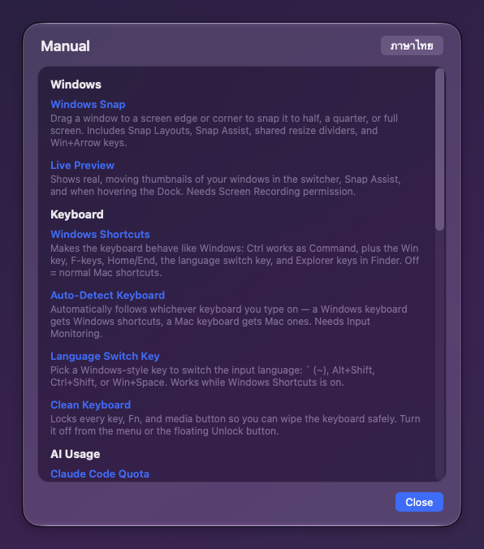

# Deft

**Give your Mac the Windows habits you miss — free, native, and open source.**

Deft is a lightweight macOS menu-bar app that brings the window-management and keyboard behaviour of Windows to your Mac, without changing anything permanently.

<p align="center"></p>

## Features

- **Windows Snap** — drag windows to edges/corners to snap them; Snap Layouts, Snap Assist, shared resize dividers, and `Win`+arrow keys. A maximized window shrinks to half size the moment you drag it, like Windows.
- **Live Preview** — real, moving window thumbnails in the switcher (`Alt`+`Tab` in Windows mode, `Cmd`+`Tab` in Mac mode), Snap Assist, and when hovering the Dock.
- **Windows keyboard** — `Ctrl` acts as `Cmd`, the `Win` key, F-keys, Home/End, Explorer keys in Finder, a Windows-style language switch key, and auto-detection of Windows vs Mac keyboards.
- **Mouse & scroll** — independent natural-scroll for mouse and trackpad, side-button back/forward, and `Ctrl`+scroll to zoom (sent as `⌘`+scroll to apps that zoom that way, `⌘+`/`⌘−` to the rest).
- **System Monitor** — live CPU, RAM, and SSD cells in the menu bar with smooth animation; click for details.
- **AI Usage** — a Claude Code cell next to CPU/RAM showing how much of the current 5-hour window you've used, estimated from Claude Code's local logs (no account, nothing leaves your Mac). Click for tokens, approximate cost, and reset time.
- **Display controls** — resolution, refresh rate, rotation, set main display, power a display off, and a drag-to-arrange window.
- **Clean Keyboard** — lock every key so you can wipe the keyboard.
- **Manual** — a built-in guide to every feature, in English and Thai.

## See it move

**Drag to an edge to snap — Snap Assist fills the rest**



**Snap Layouts — drag to the top and pick a layout**



**Alt+Tab with live window previews**



## Screenshots

| Menu bar | System Monitor & Claude Code usage |
|---|---|
|  |  |

| Arrange Displays | Manual |
|---|---|
|  |  |

## Install

1. Download the latest **Deft.dmg** from [Releases](https://github.com/ninjait07/deft/releases/latest).
2. Open it and drag **Deft** to Applications.
3. Launch Deft and grant the permissions it asks for (see below).

The app is signed with a Developer ID and notarized by Apple, so it opens without security warnings.

Or with Homebrew:

```
brew tap ninjait07/deft https://github.com/ninjait07/deft
brew trust ninjait07/deft
brew install --cask deft
```

## Permissions & privacy

Deft works entirely on your Mac and collects nothing. It uses:

- **Accessibility** — move/resize windows and translate shortcuts.
- **Screen Recording** — draw live window previews (nothing is recorded or sent).
- **Input Monitoring** — tell a Windows keyboard from a Mac one.

The only network request Deft makes is checking for updates (a small public file on GitHub). See [PRIVACY.md](PRIVACY.md).

## Build from source

```
./build.sh                 # build + sign + launch (dev)
KNACK_VERSION=1.0 KNACK_BUILD=1 ./release.sh 1.0 1   # notarized release dmg
```

Requires macOS 13+, Xcode command-line tools, and a Developer ID for signing/notarizing. The whole app is a single Swift file: `Deft.swift`.

## Support

Deft is free. If it makes your Mac feel like home, you can tip via PromptPay (in-app) or [GitHub Sponsors](https://github.com/sponsors/ninjait07). Thank you!

## License

[GPL-3.0](LICENSE) — crafted by Non Bannawat 🇹🇭
